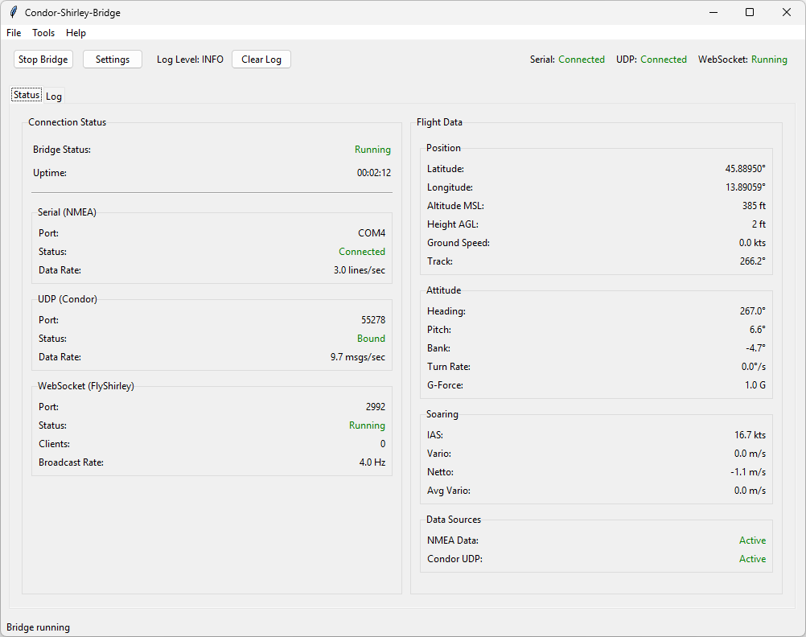
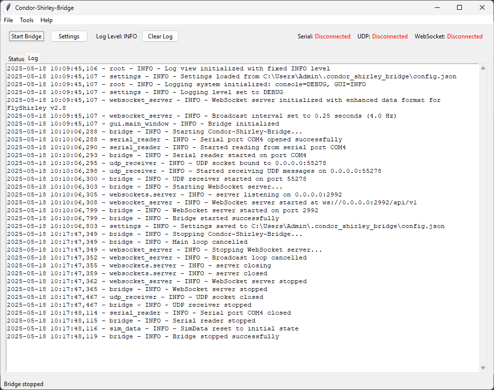
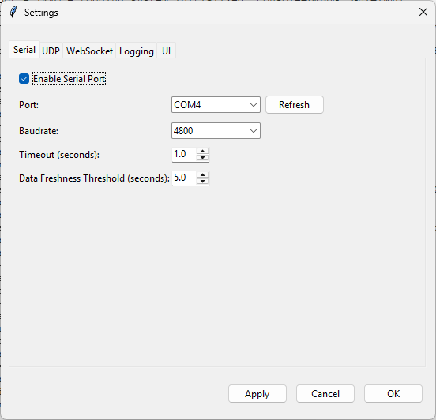

# Condor-Shirley-Bridge

A bridge application connecting Condor Soaring Simulator (https://www.condorsoaring.com/) with FlyShirley AI Copilot, Trainer and Assistant (https://airplane.team/)

## Overview

Condor-Shirley-Bridge bridges the gap between Condor Soaring Simulator and FlyShirley by:

1. Collecting flight data from Condor Soaring Simulator in two formats:
   - NMEA sentences via a virtual COM port
   - Proprietary UDP messages with extended flight parameters

2. Processing and combining this data into a unified flight model

3. Serving the processed data to FlyShirley via WebSocket in a compatible format

The result is a seamless integration that enriches your virtual soaring experience with FlyShirley's powerful electronic flight bag features.

## Features

- **Dual-source data integration** - Merges position data from NMEA with attitude data from UDP
- **Complete flight parameters** - Position, altitude, speed, vario, attitude, and more
- **WebSocket API** - Fully compatible with FlyShirley's v2.8 WebSocket API
- **User-friendly GUI** - Easy configuration and real-time status monitoring
- **Comprehensive settings** - Configure all aspects of the connection
- **Dual-mode operation** - Run with GUI or in headless CLI mode
- **Detailed logging** - Configurable logging for troubleshooting
- **Auto-reconnection** - Automatically reconnects to serial/UDP with exponential backoff
- **Input validation** - Validates all incoming data to prevent crashes from malformed input
- **Memory management** - Automatic cleanup of queues and history to prevent memory leaks
- **Robust testing** - 66 test cases with 29% overall code coverage
- **Centralized configuration** - All constants in one place for easy maintenance

## Installation

### Prerequisites

- Python 3.8 or later
- Condor Soaring Simulator with NMEA and UDP output enabled
- FlyShirley application (configured to use WebSocket)
- Virtual serial port tool like com0com (for Windows)

### Dependencies

- pyserial - For serial port communication
- websockets - For WebSocket server functionality
- tkinter - For the GUI (usually comes with Python)

### Installation Steps

1. Clone the repository:
   ```
   git clone https://github.com/jlgabriel/Condor-Shirley-Bridge.git
   cd Condor-Shirley-Bridge
   ```

2. Install the package and dependencies:
   ```
   pip install -e .
   ```

3. Run the application:
   ```
   python -m condor_shirley_bridge
   ```

## Configuration

### Condor Setup

1. In Condor, enable NMEA output to a virtual COM port
   - Use a virtual serial port tool like com0com (create a pair, e.g., COM3-COM4)
   - Set up Condor to output to one end (e.g., COM3)
   - Configure Condor-Shirley-Bridge to read from the other end (e.g., COM4)
   - Default baud rate: 4800

2. Enable UDP output in Condor
   - Configure Condor to send UDP data to IP 127.0.0.1 port 55278

### FlyShirley Setup

Configure FlyShirley to connect to the WebSocket server:
- Address: ws://localhost:2992/api/v1
- (Or use the IP address of the computer running the bridge if different)

### Bridge Configuration

The application uses a configuration file located at:
- Windows: `C:\Users\<username>\.condor_shirley_bridge\config.json`
- macOS/Linux: `~/.condor_shirley_bridge/config.json`

Default settings:
- Serial: COM4, 4800 baud
- UDP: 0.0.0.0:55278
- WebSocket: 0.0.0.0:2992/api/v1

You can modify these settings through the GUI or by editing the configuration file directly.

## Usage

### GUI Mode

To start with the graphical interface:

```
python -m condor_shirley_bridge
```

The GUI provides:
- Status indicators for all connections
- Real-time flight data display
- Settings configuration
- Start/stop controls

### CLI Mode

For headless operation:

```
python -m condor_shirley_bridge --cli
```

### Command-line Options

```
usage: condor_shirley_bridge [-h] [--cli] [--config CONFIG] [--start] [--minimized]
                            [--log-level {DEBUG,INFO,WARNING,ERROR,CRITICAL}] [--log-file LOG_FILE]

options:
  -h, --help            show this help message and exit
  --cli                 Run in command-line mode (no GUI)
  --config CONFIG, -c CONFIG
                        Path to configuration file
  --start               Automatically start the bridge on launch
  --minimized           Start minimized (GUI mode only)
  --log-level {DEBUG,INFO,WARNING,ERROR,CRITICAL}
                        Set logging level
  --log-file LOG_FILE   Log to specified file
```

## FlyShirley Data Integration

Condor-Shirley-Bridge provides the following data to FlyShirley:

### Position Data
- Latitude and longitude
- MSL and AGL altitude (converted to feet)
- Indicated airspeed (knots)
- Ground speed (knots)
- Vertical speed (feet per minute)

### Attitude Data
- Roll angle (degrees)
- Pitch angle (degrees)
- True heading (degrees)
- True ground track (degrees)

### Environment Data
- Wind speed (approximated from turbulence data)

### Levers and Controls
- Flaps settings (as percentage)

### Indicators
- Total energy variometer (feet per minute)

All data is formatted according to FlyShirley's v2.8 SimData schema specifications to ensure compatibility.

## How It Works

1. **Data Collection**:
   - NMEA Parser interprets serial data from Condor
   - UDP Receiver collects proprietary Condor messages

2. **Data Processing**:
   - SimData module combines data from both sources
   - Resolves conflicts and fills in missing information
   - Converts units as necessary (meters to feet, m/s to fpm, etc.)

3. **Data Distribution**:
   - WebSocket Server broadcasts to FlyShirley at configurable intervals (default: 4 Hz)
   - Data is formatted according to FlyShirley's API expectations

## Development

### Project Structure

```
condor_shirley_bridge/
├── core/              # Core functionality
│   ├── bridge.py      # Main orchestrator
│   ├── settings.py    # Configuration management
│   └── sim_data.py    # Flight data model
├── gui/               # GUI components
│   ├── main_window.py # Main application window
│   ├── status_panel.py # Flight data display
│   └── settings_dialog.py # Settings configuration
├── io/                # Input/output components
│   ├── serial_reader.py # NMEA serial port reader
│   ├── udp_receiver.py # Condor UDP receiver
│   └── websocket_server.py # FlyShirley interface
└── parsers/           # Data parsers
    ├── nmea_parser.py # NMEA sentence parser
    └── condor_parser.py # Condor UDP parser
```

### Building from Source

To build the project from source:

```
python setup.py build
python setup.py install
```

### Testing

The project includes comprehensive test coverage:

```bash
# Install development dependencies
pip install -e ".[dev]"

# Run all tests
pytest tests/

# Run tests with coverage report
pytest tests/ --cov=condor_shirley_bridge --cov-report=html

# Run specific test category
pytest tests/unit/          # Unit tests only
pytest tests/integration/   # Integration tests only
```

**Test Coverage:**
- 66 test cases covering parsers, data flow, settings, and sim data
- 29% overall coverage with critical modules at 70%+:
  - `condor_parser.py`: 91%
  - `nmea_parser.py`: 80%
  - `sim_data.py`: 73%
  - `settings.py`: 61%

**Quality Assurance Features:**
- Input validation for all NMEA and UDP data
- Automatic reconnection with exponential backoff
- Memory leak prevention through periodic cleanup
- Comprehensive error handling and logging

## Troubleshooting

### Common Issues

**No NMEA data received**:
- Verify Condor is configured to output NMEA
- Check the correct COM port is selected
- Ensure no other application is using the COM port
- Verify the com0com virtual serial port pair is properly set up

**No UDP data received**:
- Confirm Condor is configured to send UDP data
- Check firewall settings
- Verify correct port number

**FlyShirley not connecting**:
- Ensure WebSocket server is running
- Check network connectivity between devices
- Verify WebSocket URI format in FlyShirley (ws://localhost:2992/api/v1)
- Check logs for any JSON formatting errors

**Application crashing**:
- Check log file for error details
- Verify all dependencies are installed
- Try running with `--log-level DEBUG` for more information

## Future Enhancements

We are working with the FlyShirley development team to enhance the integration with additional soaring-specific data fields, including:

- Netto variometer
- Energy-compensated variometer
- MacCready settings
- Water ballast information
- Quaternion-based attitude representation
- Thermal and ridge lift data

## License

This project is licensed under the MIT License - see the [LICENSE](LICENSE) file for details.

## Acknowledgments

- Thanks to the Condor Soaring Simulator Team for the great gliding experience.
- Thanks to the FlyShirley team for their electronic flight bag for pilots.
- Based on https://github.com/Airplane-Team/sim-interface by Airplane Team.
- Based on https://github.com/jlgabriel/ForeFlight-Shirley-Bridge by Juan Luis Gabriel.
- Code assistance provided by Anthropic Claude 3.7 Sonnet.

## Screenshots





